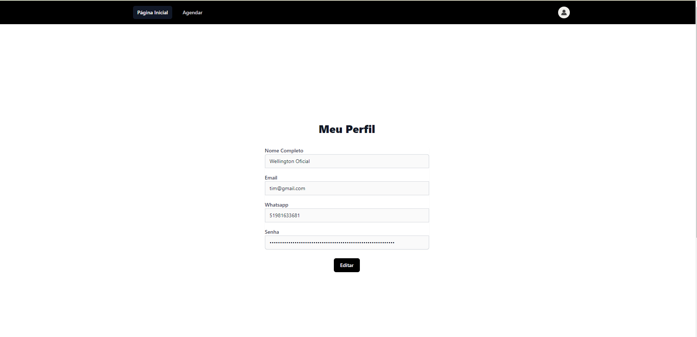
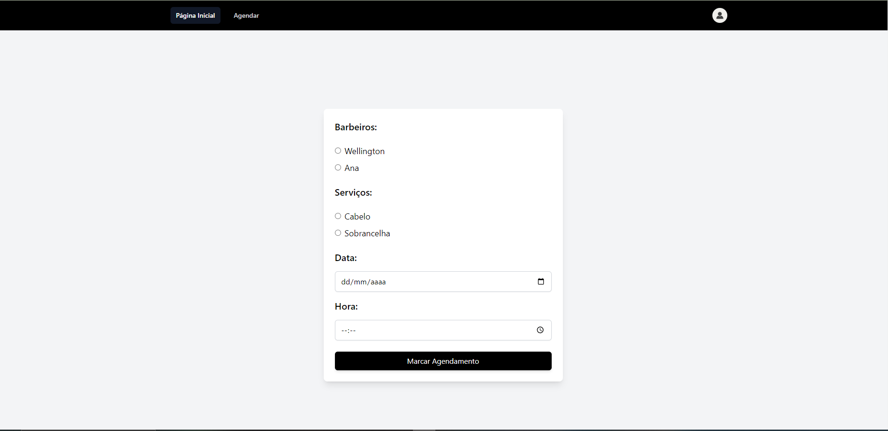
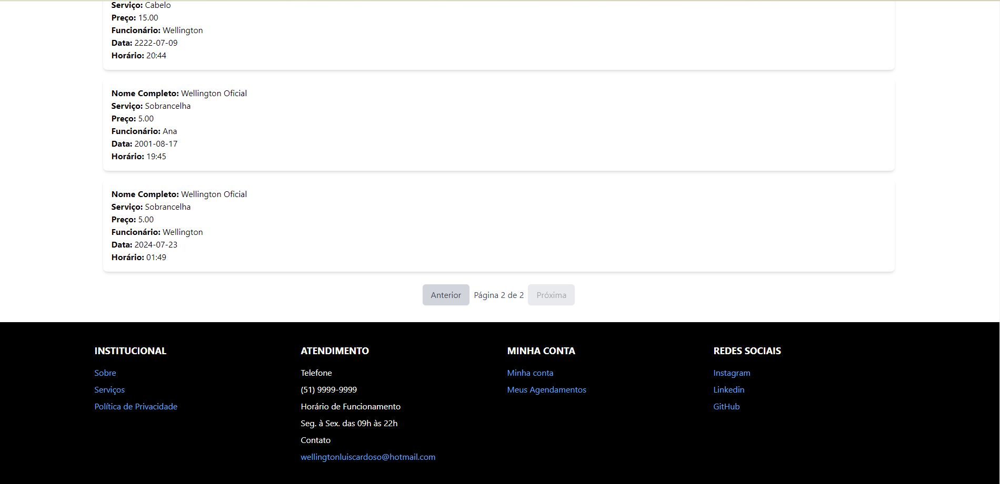

<h1 align="center" style="font-weight: bold;">Barbearia do Tim(Front) 💻</h1>

<p align="center">
 <a href="#tech">Technologies</a> • 
 <a href="#started">Getting Started</a> • 
 <a href="#contribute">Contribute</a>
</p>


<p align="center">
     <a href="https://github.com/wellingtonflores/FrontBarbearia">📱 Visit this Project</a>
</p>

<h2 id="layout">🎨 Layout</h2>

<p align="center">
    
    
    
    
    
    
    
</p>

<h2 id="technologies">💻 Technologies</h2>

- JavaScript
- React
- HTML
- CSS
- React Router Dom
- Tailwind
- Axios

<h2 id="started">🚀 Getting started</h2>

<h3>Prerequisites</h3>

- [NodeJS](https://github.com/)
- [Git 2](https://github.com)

<h3>Cloning</h3>

```bash
git clone https://github.com/wellingtonflores/FrontBarbearia
```

<h3>Starting</h3>

```bash
cd Barbearia
npm install
```

<h2 id="contribute">📫 Contribute</h2>

1. `git clone https://github.com/wellingtonflores/FrontBarbearia`
2. `git checkout -b feature/FrontBarbearia`
3. Follow commit patterns
4. Open a Pull Request explaining the problem solved or feature made, if exists, append screenshot of visual modifications and wait for the review!

<h3>Documentations that might help</h3>

[📝 How to create a Pull Request](https://www.atlassian.com/br/git/tutorials/making-a-pull-request)

[💾 Commit pattern](https://gist.github.com/joshbuchea/6f47e86d2510bce28f8e7f42ae84c716)